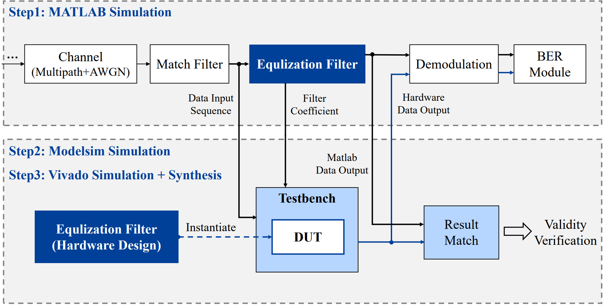

根据实验指导书的内容，以下是整理后的第一节和第二节内容：

# Lab1: Equalizer Design

## I. Experiment Overview and Objectives

### 1.1 实验目的
*   学习 **Equalizer**（均衡器）的原理和设计方法，理解其在 **Communication System** 中的关键作用。
*   熟练掌握 **MATLAB**、**ModelSim**、**Vivado** 等 EDA 工具的使用流程。
*   深入理解并应用 **Folding**（折叠架构）、**Unfolding**（展开架构）、**Systolic Array**（脉动阵列）等 VLSI 设计优化技术。
*   探索 **AI-assisted circuit design**（AI 辅助电路设计）方法，利用 **LLM**（大语言模型）或 **Agent**（智能体）生成并优化 **Digital Circuit**。

### 1.2 实验平台与任务分工
*   **MATLAB**：负责基带通信系统链路仿真、**Equalization Filter** 设计、**BER**（误码率）分析以及 **Fixed-point Quantization**（定点量化）数据准备。
*   **ModelSim**：执行 **RTL** 程序的仿真与功能验证。
*   **Vivado**：完成 **RTL** 设计的综合（**Synthesis**），分析电路的 **Timing**（时序）、**Area**（面积/资源）等性能指标。
*   **团队合作**：本次实验支持组队，每组至多两人。

### 1.3 实验流程


---

## II. Experiment Content: MATLAB Simulation

### 2.1 基带通信系统链路实现
实验提供了一个完整的基带通信系统仿真代码，包含以下关键模块：
1.  **Data Generator**：随机生成 0/1 序列。
2.  **Modulation**：采用 **BPSK** 调制。
3.  **Pulse Shaping Filter**：本次实验使用理想矩形脉冲，实际操作中可忽略。
4.  **Channel**：包含 **Multipath**（多径效应）引起的 **ISI**（码间串扰）和信道本身的 **AWGN**（加性高斯白噪声）。
5.  **Match Filter**：匹配滤波，本实验中可忽略。
6.  **Equalization Filter**：均衡滤波器，是本次硬件设计的核心（**DUT**）。
7.  **Demodulation**：**BPSK** 解调。
8.  **BER Module**：计算 **Bit Error Rate**。

### 2.2 仿真验证与性能要求
1.  **性能对比**：通过大批量仿真，对比以下三种情况的 **BER Curve** 和接收信号分布：
    *   情况一：**Theoretical Value**（理论值），仅有 **AWGN**，无多径影响。
    *   情况二：加入 **Multipath** 效应，但不进行均衡滤波。
    *   情况三：加入 **Multipath** 效应，并进行 **Equalization** 滤波。
2.  **抽头优化**：将提供的 **3-tap FIR** 滤波器提升为 **N-tap**。**目标要求**：在 **BER** 达到 $10^{-6}$ 以下时，信噪比 $E_b/N_0 \leq 23\text{dB}$。
3.  **约束条件**：实验过程中不得修改多径信道参数。

### 2.3 定点量化 (Fixed-point Quantization) 原理
为了将算法转化为硬件实现，必须进行定点化处理：
*   **量化过程**：包含 **Saturation**（饱和处理）和 **Truncation**（截位处理）。
    *   **Saturation**：数据超出表示范围时，饱和到最大或最小边界。
    *   **Truncation**：采用 **Floor**（向下取整）或 **Round**（四舍五入）方式处理多余的小数位。
*   **MATLAB 实现**：使用 `fi` 函数构造定点数值对象。
    *   函数格式：`a = fi(v, s, w, f)`。其中 `s` 为符号位，`w` 为 **Word Length**（字长），`f` 为 **Fraction Length**（小数长度）。
    *   **示例**：定点位宽 (1, 2, 5) 表示 1 位符号位、2 位整数位、5 位小数位，其表示精度为 $2^{-5} = 0.03125$。

---

## III. Hardware Design and Simulation Verification

### 3.1 RTL 参数与接口定义
在编写 **RTL** 代码时，需定义以下关键参数和接口以实现 **Equalization Filter**：
*   **Hardware Parameters**:
    *   `TAP_N`：滤波器抽头数。
    *   `IL` / `FL`：定点数的 **Integer Length**（整数位宽）和 **Fraction Length**（小数位宽）。
    *   `DATA_W`：总字长，计算公式为 $FL + IL + 1$。
*   **Signal Interface**:
    *   `clk` / `rst_n`：时钟与低电平有效的复位信号。
    *   `valid_i` / `valid_o`：输入与输出的握手使能信号。
    *   `data_i` / `data_o`：输入与输出的数据总线。
    *   `coeff`：滤波器系数输入，位宽取决于抽头数与定点字长。

| 信号名   | 位宽                      | 描述                     |
| -------- | ------------------------- | ------------------------ |
| clk      | 1                         | 时钟信号                 |
| rst_n    | 1                         | 复位信号（低电平使能）   |
| valid_i  | 1                         | 输入使能                 |
| data_i   | 1+DI_IL+DI_FL             | 输入数据                 |
| coeff    | (1+C_IL+C_FL)×TAP_N       | 滤波器系数               |
| valid_o  | 1                         | 输出使能                 |
| data_o   | 1+DO_IL+DO_FL             | 输出数据                 |

### 3.2 硬件架构设计要求
实验要求实现全部三种硬件结构，并进行性能对比：
1.  **Folding Architecture (A1)**：通过 **Folding** 技术优化面积，设计目标是使电路 **Area** 最小化。
2.  **Unfolding Architecture (A2)**：通过 **Unfolding** 技术优化处理速度，设计目标是使 **Speed** 最快。
3.  **Systolic Array (A3)**：**可应用 **Systolic Array** 优化吞吐率，使 **Throughput** 达到最高。
    *   **注**：建议利用 **AI-assisted design**（如 LLM）辅助生成 **Unfolding** 或 **Systolic Array** 的代码，并记录 **Prompt** 设置与调试过程。

### 3.3 功能仿真与验证 (ModelSim)
*   **Workflow**：编写 **RTL** $\rightarrow$ 编译与仿真 $\rightarrow$ 结果比对。
    * 根据设计 FIR 滤波器的抽头数、定点抽头系数等，编写 **RTL** 源程序
    * 利用 Modelsim and Vivado **编译与执行仿真**
    * 通过比较仿真输出与MATLAB输出结果，验证硬件设计功能的正确性。
*   **Testbench 技巧**：
    *   使用 `$readmemb` 函数从文本文件加载 **MATLAB** 生成的定点测试向量。
    *   使用 `$fopen`、`$fwrite` 和 `$fclose` 函数将硬件计算结果输出到文本，以便与 **MATLAB** 的仿真结果进行 **Bit-accurate**（位一致）比对。

---

## IV. Logic Synthesis and Performance Analysis

### 4.1 Vivado 综合与约束设置
*   **Target Device**：选用 **Kintex-UltraScale KCU105** 开发板。
*   **Timing Constraints**：需要在 **Vivado** 工程的 **Constraints** 中添加 `.xdc` 文件。
    *   **示例指令**：`create_clock -name clkin -period 3.3 -waveform {0 1.65} [get_ports clk]`。
    *   **性能目标**：综合后的最大工作频率必须超过 **300MHz**。

### 4.2 性能分析与数据整理
完成综合（**Synthesis**）后，需要从 **Vivado** 中提取并讨论以下信息：
*   **Timing Information**：查看 **Report Timing Summary**，分析 **WNS**（最差负时序裕量）等关键路径信息。
*   **Area/Resource Utilization**：查看 **Report Utilization**，记录 **LUT**、**FF**（触发器）和 **DSP** 等资源的使用数量。
*   **Performance Comparison**：整理表格，定量对比不同架构（如 **Folding** vs **Unfolding**）在时序、面积和 AI 辅助带来的性能提升。

---

## V. Functional Verification

### 5.1 三种情况下误码率曲线对比

- 情况一：MATLAB工具bertool得到的理论值，只有AWGN，没有多径影响；
- 情况二：加入多径效应，但不进行均衡滤波；
- 情况三：加入多径效应，并进行均衡滤波

1. **曲线：半对数坐标**
  - 横轴：信噪比（ebn0）
  - 纵轴：误码率（ber）
2. 抽头数提升后的效果对比
3. 硬件实现与软件实现的效果对比

### 5.2 三种情况下接收信号分布对比

- 情况一：MATLAB工具bertool得到的理论值，只有AWGN，没有多径影响；
- 情况二：加入多径效应，但不进行均衡滤波；
- 情况三：加入多径效应，并进行均衡滤波。

1. **曲线：散点图**
   - 横轴：bpsk调制，接收信号仅在一维上分布
   - 纵轴：区分不同情况
2. 抽头数提升后的效果对比
3. 硬件实现与软件实现的效果对比

---

## VI. AI-assisted Circuit Design

### 6.1 AI 辅助设计要求
*   **设计范围**：建议在 **Unfolding** (A2) 和 **Systolic Array** (A3) 的电路设计中探索使用 AI 辅助技术。
*   **记录内容**：实验报告需详细记录以下内容：
    *   使用的平台或 **LLM**（大语言模型）。
    *   设计的 **Prompt**（提示词）及其迭代过程。
    *   代码生成、调试、验证和优化的全过程。
    *   关于 AI 辅助设计方法论的个人思考。

### 6.2 评分与加分项
*   **基础评分**：AI 辅助技术的基础使用占总分的 5%。
*   **性能提升**：使用 AI 优化后取得的电路性能提升占总分的 5%。
*   **额外加分**：在 AI 辅助方面展示具有新颖性的内容、技术，或能系统分析 AI 辅助电路设计方法论的同学可获得额外加分。

---

## VII. Technical Notes and Troubleshooting

### 7.1 硬件实现细节补充
*   **滤波器系数**：**Filter Coefficient** 可以作为模块的输入信号，也可以直接作为参数（**Parameter**）定义在模块内部。
*   **Testbench 文件操作**：
    *   使用 `$readmemb` 函数从 `.txt` 文件读取测试数据。例如 `$readmemb("E:/LAB1/data.txt",memory);`
    *   使用 `$fopen`、`$fwrite`（按二进制格式写入）和 `$fclose` 将硬件计算结果输出，写入 `txt` 文件，以便进行对比验证。

### 7.2 Vivado 使用疑难解答
*   **器件支持**：如果在 **Boards** 中找不到 **Kintex-UltraScale**，需根据教程安装扩展资源，必要时勾选 **Vivado ML Enterprise** 版本。
*   **时钟约束设置**：在 **Constraints** 中添加 `.xdc` 文件，使用 `create_clock` 指令创建理想时钟（例如：周期 3.3ns，占空比 50%）。
*   **结果查看**：通过 **Report Timing Summary** 查看 **Timing** 信息（如 **WNS**）；通过 **Report Utilization** 查看 **Resource** 占用情况（如 **LUT**、**FF**、**DSP**）。

---

## VIII. Report and Submission Guidelines

### 8.1 实验报告内容要求
报告应至少包含以下板块：
1. **Design**：
   1. **Equalization Filter** 电路图
   2. 主要模块接口信号描述
   3. 关键实现细节（A1 及 A2/A3）。
   4. **AI Details**：详细说明利用 AI 工具辅助设计的提示词和调试方法。
2. **Results**：
   1. **MATLAB** 与 **Verilog** 的功能验证结果
   2. **Vivado** 综合结果（需配截图）。
3. **Analysis**：对 **Critical Path**（关键路径）、**Area**（面积）、**Resource**（资源）的分析，以及 AI 带来的性能提升对比表。
4. **Division of Labor**：明确团队成员的分工情况。

### 8.2 提交规范与截止日期
*   **截止时间**：5 月 6 日 23:59 之前。
*   **递交方式**：通过 **Canvas** 平台上传。
*   **目录结构**：
    ```text
    lab1_姓名1_学号1_姓名2_学号2
    ├── matlab_code
    ├── hardware
    │   ├── folding
    │   │   ├── src
    │   │   └── tb
    │   ├── unfolding
    │   │   ├── src
    │   │   └── tb
    │   └── systolic
    │       ├── src
    │       └── tb
    └── report.pdf
    ```
