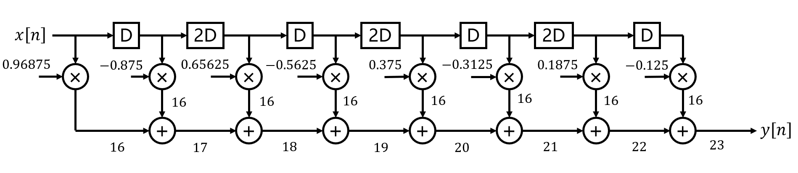
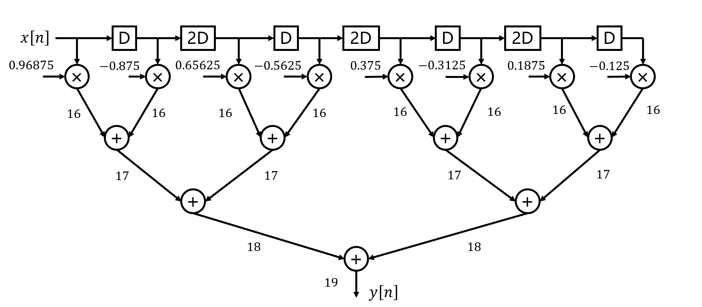
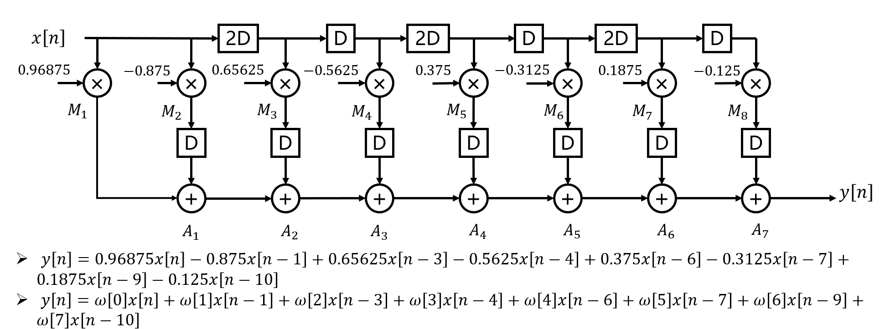
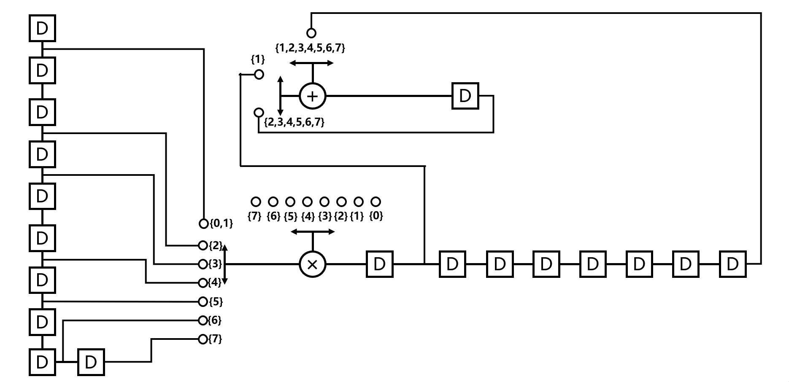
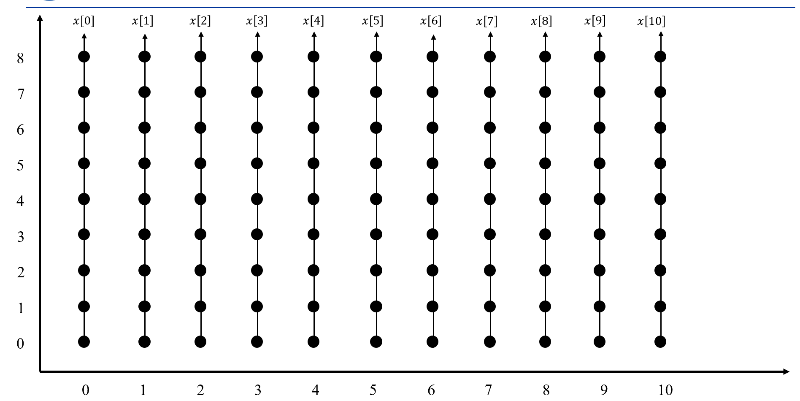
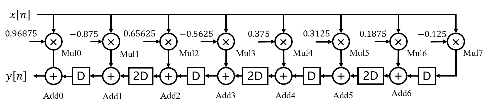

# 11 Tap FIR Equalizer Design and RTL Implementation

本文档主要对 Equalizer 项目中均衡滤波器的算法原理、系数推导以及基于多种架构（原型、加法树、折叠）的 RTL 硬件设计逻辑进行梳理与解析。

## I. 背景介绍与均衡滤波器引入

### 1.1 码间串扰（ISI）与多径效应

在高速数字通信系统中，信号在信道传输时往往会因为多径效应（Multipath）产生信号**折射和延时**，导致前后码元相互重叠干扰，同时伴随着加性**高斯白噪声（AWGN）的影响**，使得接收端误码率（BER）显著恶化。这两种作用形如：
- 多径效应：模拟为信道冲激响应与输入信号的卷积, $x'[n] = h[n] * x[n]$
- AWGN：在信号基础上叠加高斯分布的随机噪声, $y[n] = x'[n] + w[n]$

在理想的 AWGN 信道下，BPSK 调制的理论误码率 $P_b$ 与信噪比 $E_b/N_0$ 紧密遵循互补误差函数关系：

$$P_b = Q(\sqrt{2E_b/N_0})$$

然而，当存在多径效应时，即便信噪比无限增大，ISI 也会导致误码率无法继续下降，产生 **“误码平底（Error Floor）”** 现象，实际的 $P_b-E_b/N_0$ 曲线会严重偏离理论基准线。

### 1.2 均衡器（Equalizer）的作用
为了消除或减轻 ISI 对接收端判决的影响，需要在接收端引入均衡滤波器。其本质是一个**有限长冲激响应（FIR）数字滤波器**。通过与多径信道发生逆向级联，均衡器能将整体频率响应尽可能拉平，压制时域拖尾。最终目标是不仅将误码率降至目标裕度（如 $10^{-6}$ ），还能使此时的误码率曲线尽可能贴近 AWGN 理论曲线。

## II. 滤波器系数计算与 MATLAB 实现
在进行硬件数字电路编写前，必须先在核心算法域决定滤波器的长度与各抽头（Tap）系数 $\mathbf{w}$ ，这本质上是解一个 $\mathbf{Y}\mathbf{w} \approx \mathbf{d}$ 的矩阵逆运算问题。

### 2.1 数据矩阵构建
假设我们向信道输入了已知的训练参考序列 $\mathbf{d}$ 。接收端捕获到受干扰的信号序列后，利用滤波器长度作为窗口进行滑动采样，构造出包含历史接收数据的 Toeplitz（或滑窗）数据矩阵 $\mathbf{Y}$ 。

### 2.2 系数求解算法：

**迫零均衡（Zero-Forcing, ZF）**：目标是彻底消除 ISI，强行令信道与均衡器的级联响应只在最优判决点为 1，其余全为 0。利用矩阵伪逆直接求解超定方程：

$$\mathbf{w}_{ZF} = (\mathbf{Y}^T\mathbf{Y})^{-1}\mathbf{Y}^T\mathbf{d}$$

由于其单纯求解矩阵的代数逆，当遇到信道频域深衰落点时，它会为了拉起频率响应而严重放大对应频段的高频噪声。

**最小二乘法（Least Squares, LS）**：以最小化滤波器输出与理想信号的总误差平方和：

$$\min ||\mathbf{Y}\mathbf{w} - \mathbf{d}||^2$$ 

为目标。
在带噪声的综合数据矩阵下求解常规法线方程 

$$\mathbf{w}_{LS} = (\mathbf{Y}^T\mathbf{Y})^{-1}\mathbf{Y}^T\mathbf{d}$$

（或等效的 MMSE 相关矩阵解法）时，由于训练数据中已经涵盖了实际噪声统计规律，算法会自动在“消除 ISI”和“限制噪声放大”之间达成最佳折中。

### 2.3 目标冲激响应组合

本设计目标在 $E_b/N_0 = 10$ dB 时达到 $P_b < 10^{-6}$ 的性能要求。我们设定 $\text{margin} = 1$ dB 的安全阈值，通过上述算法求解得到的抽头数最低的滤波器系数 $\mathbf{w}$ 组合成的目标冲激响应为：

$$h[n] = \{0.97396, -0.86000, 0.00876, 0.64376, -0.56288, 0.01060, 0.39000, -0.32613, 0.00746, 0.18332, -0.12365\}$$

### 2.4 MATLAB 定点化（Fixed-point Quantization）

数字硬件底层实现中无法实现双精度位宽这样大面积开销的计算，此外高精度带来的性能提升不一定理想。
因此我们实现时对连续浮点信号流及浮点权重矩阵进行**饱和处理（Saturation）**和**截位处理（Truncation）**，从而导出定点量化后的滤波器系数以及测试数据。

在本设计中，我们选定的定点数格式为：

| 符号位 | 整数位 | 小数位 |
|---|---|---|
| 1 | 2 | 5 |

这样能够实现的数值范围为：$[-4, 3.96875]$ 。

量化后的滤波器系数为：

| Tap Index | 0 | 1 | 2 | 3 | 4 | 5 | 6 | 7 | 8 | 9 | 10 |
|-----------|---|---|---|---|---|---|---|---|---|---|----|
| 浮点值 | 0.97396 | -0.86000 | 0.00876 | 0.64376 | -0.56288 | 0.01060 | 0.39000 | -0.32613 | 0.00746 | 0.18332 | -0.12365 |
| 量化值 | 0.96875 | -0.87500 | 0.00000 | 0.65625 | -0.56250 | 0.00000 | 0.37500 | -0.31250 | 0.00000 | 0.18750 | -0.12500 |

经过测试，我们发现量化后的滤波器性能仍然能够满足设计要求，并且我们发现有 3 个抽头系数直接被截位为 0，直接省掉了 3 个乘法器的面积开销。

## III. 电路优化技术与 RTL 设计
在 RTL 硬件实现层面，滤波器的核心是离散卷积带来的繁重乘加操作（MAC）。本项目利用基本型与不同经典的电路优化技术探索了三种架构：

### 3.1 原型实现 (Baseline)

**原理**：教材中最标准的直接型 FIR 滤波器实现形式。系统以空间换时间，在单时钟周期内铺开所有的硬线定点乘法，并通过一长串组合逻辑相加取得结果。

### 3.2 平衡加法树 (Balanced Adder Tree)

**原理**：针对 Baseline 关键路径极其拉长的缺陷进行图论层面重构，采用**平衡二叉树结构**来重新组织终级加法网。

### 3.3 折叠架构 (Folding Architecture)

**原理**：以面积（Area）极限换取得吞吐率的时间多路复合并用（Time-Multiplexing）技术。对于我们 8 个抽头的计算，如果外部并不要求极度密集的流水线喂数据（如外部输入间隔 $\ge 8$ 个时钟周期），此时只要单独放置 1 个乘法器与 1 个加法器，并令其以主时钟进行时分复用。

在实现时，我们发现直接对原始电路进行折叠会导致折叠方程不满足延迟要求，因此之前必须进行重定时，重定时之后的电路为：

在此基础上，进行**折叠因子为 8 的电路折叠**：

**RTL 逻辑**：
- 维护**两个移位寄存器**，分别存储输入数据以及乘法器输出结果。同时乘法器输出结果的移位寄存器中间输出可用于调试。
- **选通逻辑**通过维护位宽为 3 bit 的**折叠计数器**来实现，实现简易版“状态机”。本设计由于状态数量多且状态转移逻辑很简单，无需采用复杂的三段式有限状态机。
- 在 {7} 选通时刻**将加法器的输出直接作为输出数据**。这一点较危险，后续可以考虑用寄存器打拍输出。

### 3.4 脉动阵列 (Systolic Array)

**原理**：通过构建一个规则化的处理单元阵列，并在每个单元内实现局部数据交换与计算，来实现理论上的高吞吐率。每个处理单元负责一个抽头的乘加操作，并通过流水线方式将数据在单元间传递。

本设计构造出的数据依赖图如下：

本设计采取的投影矢量、处理器矢量、调度矢量分别为：
- 投影矢量: $d=(1,0)$
- 处理器矢量: $p=(0,1)$
- 调度矢量: $t=(1,0)$

权重、输入、输出矢量分别为：
- 权重矢量: $e_{\text{weight}} = (1,0)$
- 输入矢量: $e_{\text{input}} = (0,1)$
- 输出矢量: $e_{\text{output}} = (1,-1)$

利用上述矢量构造出的脉动阵列电路架构如下：

注意，此时的输入通过组合逻辑直连输出，在 RTL 实现时最好通过寄存器打拍输出以保证时序稳定。

### 3.5 展开架构 (Unfolding Architecture)
**原理**：把原来电路中按时间顺序反复执行的运算，转换成并行的多个运算单元同时工作。将原系统按展开因子N复制成N条并行数据通路，并重新安排延时单元和信号连接关系，使系统在保持原有功能不变的前提下，降低关键路径延迟提高吞吐率。
在此基础上，进行N=2的电路展开，得到的电路图如下：
